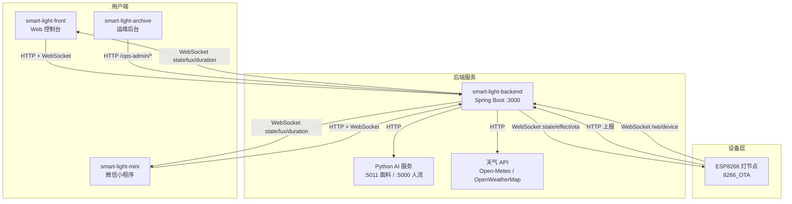
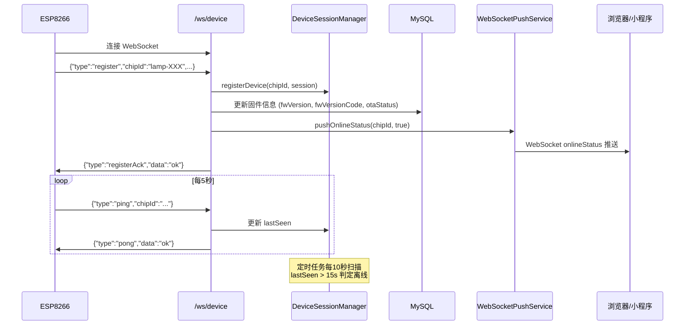
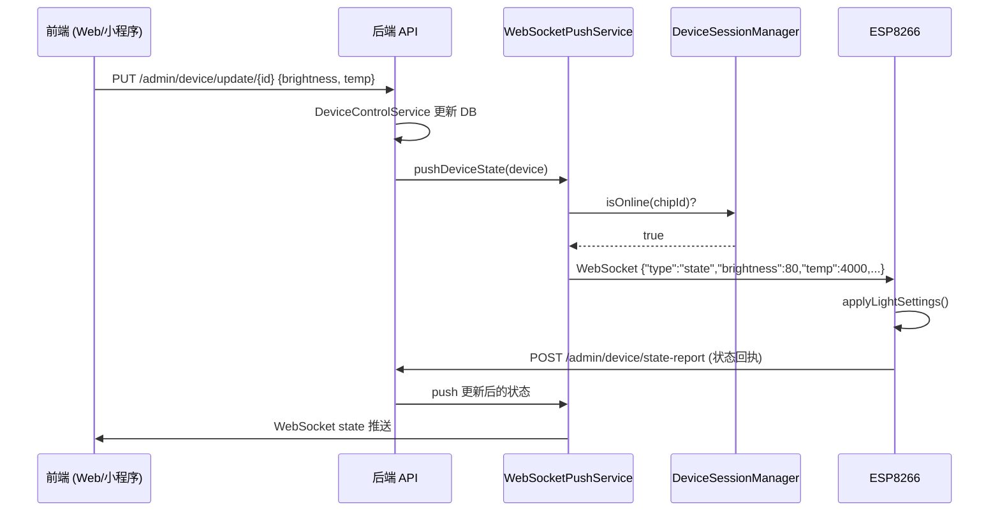
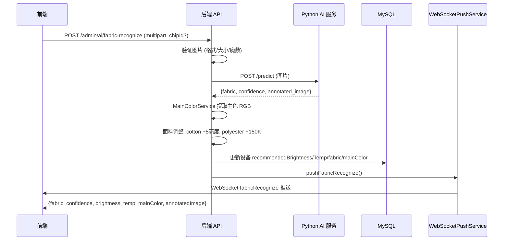
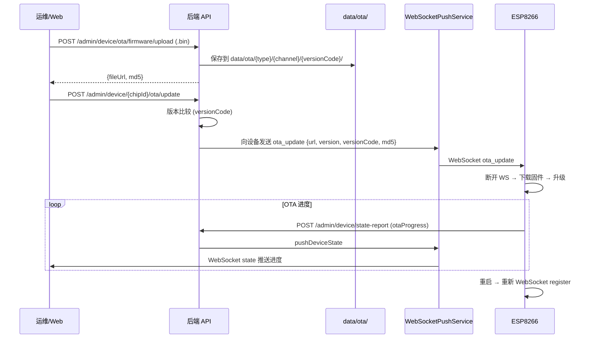

# 项目分析报告 - smart-light-backend

## 1. 项目基本信息

| 项目属性 | 内容 |
|----------|------|
| **项目路径** | `E:\smart-light-backend` |
| **项目类型** | Spring Boot 4 后端服务 |
| **技术栈** | Spring Boot 4.0.5, Java 17, MyBatis-Plus 3.5.15, MySQL, Maven |
| **主要运行环境** | JVM 17+, 默认端口 3000 |
| **主要职责** | 用户认证、店铺管理、设备管理、设备状态上报、WebSocket 双向通信 (浏览器+设备)、AI 服装识别、主色提取、OTA 固件管理、客流/照度/停留时长统计、天气采集、灯光效果管理、运维后台 |
| **与其他项目的关系** | 系统核心后端，为 `smart-light-front` (Web), `smart-light-mini` (小程序), `smart-light-archive` (运维后台) 和 ESP8266 设备提供 HTTP REST API + WebSocket 服务 |
| **Git 仓库** | 是，当前分支 `master`，状态 clean |

## 2. 项目目录结构

| 目录 | 用途 | 类型 |
|------|------|------|
| `src/main/java/com/genius/smartlight/` | Java 源码根包 | 核心源码 |
| `controller/admin/` | 14 个业务控制器 (认证/设备/AI/光照/天气等) | 核心源码 |
| `opsadmin/` | 7 个运维面板控制器 + 认证过滤器 | 核心源码 |
| `service/` | 约 40 个服务接口与实现类 | 核心源码 |
| `dal/dataobject/` | 7 个数据实体类 (DO) | 核心源码 |
| `dal/mysql/` | 7 个 MyBatis-Plus Mapper 接口 | 核心源码 |
| `vo/` | 约 30 个 VO/DTO 类 | 核心源码 |
| `websocket/` | 8 个 WebSocket 相关类 | 核心源码 |
| `security/` | 5 个安全相关类 (JWT/SecurityConfig) | 核心源码 |
| `config/` | 7 个配置类 (CORS/WebSocket/Swagger/OTA等) | 核心源码 |
| `schedule/` | 2 个定时任务 | 核心源码 |
| `common/` | 5 个公共类 (响应体/异常处理等) | 核心源码 |
| `integration/` | 2 个 AI 服务 HTTP 客户端 | 核心源码 |
| `convert/` | 3 个数据转换器 | 核心源码 |
| `src/main/resources/` | 配置文件目录 | 核心配置 |
| `data/` | OTA 固件存储 + 上传文件 | 运行时数据 |
| `docs/` | 项目文档 | 文档 |
| `target/` | Maven 构建产物 | 构建产物 (排除) |

## 3. 代码规模统计

| 统计项 | 数值 |
|--------|------|
| Java 源文件数 (.java) | 167 |
| 总 Java 代码行数 | ~13,474 |
| 配置文件 | 3 (application.yaml, application-example.yaml, logback-spring.xml) |
| SQL 脚本 | 1 (weather_schema.sql) |

### 按类别的文件数

| 类别 | 数量 |
|------|------|
| @RestController / @Controller | 23 (含 1 个 @RestControllerAdvice) |
| @Service / @Component 服务类 | 29 |
| Mapper 接口 | 7 |
| Entity/DO 类 | 7 |
| VO/DTO 类 | 40+ |
| 配置类 | 7 |
| WebSocket 相关类 | 8 |
| 定时任务 | 2 |
| AI 集成客户端 | 2 |

### 最大的源文件

| 文件 | 大致行数 | 说明 |
|------|---------|------|
| `AiServiceImpl.java` | ~300+ | AI 识别 + 图片验证 + 面料调整逻辑 |
| `WeatherServiceImpl.java` | ~300+ | 天气采集 + 多源切换 + 指数退避 |
| `DeviceOtaFirmwareServiceImpl.java` | ~230+ | 固件上传管理 |
| `DurationServiceImpl.java` | ~220+ | 停留时长统计 |
| `OpsAdminStoreController.java` | ~100+ | 运维面板多店管理 |

## 4. 核心功能清单

### 4.1 HTTP REST API 总览

| 功能模块 | Controller | 端点数量 | 说明 |
|----------|-----------|---------|------|
| 用户认证 | AuthController | 2 | 注册、登录 (IP限流 + 用户名锁定) |
| 店铺管理 | StoreController | 2 | 获取/设置店铺信息 |
| 设备 CRUD | DeviceController | 12 | 创建/修改/删除/查询/绑定/定位/灯效/固件通道/OTA检查与启动 |
| 设备网关 | DeviceGatewayController | 5 | 上线通告/云台控制/服装上传/人流开关/状态同步 |
| 设备上报 | DeviceReportController | 1 | 设备状态上报 (公开放行) |
| 在线状态 | DeviceOnlineController | 2 | 查询单个/全部在线设备 |
| OTA 固件管理 | DeviceOtaFirmwareController | 2 | 固件上传/列表查询 |
| OTA 固件下载 | OtaFirmwareDownloadController | 1 | 固件 .bin 文件下载 (/ota/**) |
| 光照数据 | LuxController | 4 | 记录/查询/多设备趋势 |
| 停留时长 | DurationController | 6 | 记录/查询/汇总 |
| AI 识别 | AiController | 4 | 面料识别/留档管理/人流检测 |
| 天气 | WeatherController | 2 | 获取/采集天气 (30分钟缓存) |
| 灯光效果 | LightEffectController | 3 | 获取/保存/关闭灯效 |
| 数据分析 | AnalyticsController | 2 | 温度人流趋势/策略对比 |
| **用户端合计** | **14 个 Controller** | **约 48 个端点** | |
| 运维面板 | OpsAdmin (7 Controllers) | **约 16 个端点** | 仪表盘/固件/店铺/Gallery/日志/系统状态 |
| **总计** | **22 个 Controller** | **约 64 个端点** | |

### 4.2 用户端 API 端点详表

#### 认证 (AuthController)

| 序号 | 方法 | 路径 | 行号 | 鉴权 | 说明 |
|------|------|------|------|------|------|
| 1 | POST | `/api/auth/register` | L37 | 公开 | 账号注册 (IP限流) |
| 2 | POST | `/api/auth/login` | L45 | 公开 | 账号登录 (IP限流+用户名锁定) |

#### 店铺 (StoreController)

| 序号 | 方法 | 路径 | 行号 | 鉴权 | 说明 |
|------|------|------|------|------|------|
| 3 | GET | `/api/store/current` | L33 | JWT | 获取当前店铺 |
| 4 | POST | `/api/store/setup` | L48 | JWT | 设置店铺信息 |

#### 设备管理 (DeviceController)

| 序号 | 方法 | 路径 | 行号 | 鉴权 | 说明 |
|------|------|------|------|------|------|
| 5 | GET | `/admin/device/ping` | L42 | 公开 | 连通性测试 |
| 6 | POST | `/admin/device/create` | L48 | JWT | 创建设备 |
| 7 | PUT | `/admin/device/update/{id}` | L54 | JWT | 更新设备+灯光控制 |
| 8 | DELETE | `/admin/device/delete/{id}` | L64 | JWT | 删除设备 |
| 9 | GET | `/admin/device/get/{id}` | L73 | JWT | 按ID查询设备 |
| 10 | GET | `/admin/device/list` | L80 | JWT | 全量设备列表 |
| 11 | GET | `/admin/device/by-chip-id` | L86 | JWT | 按芯片ID查询 |
| 12 | GET | `/admin/device/my-list` | L94 | JWT | 当前店铺设备列表 |
| 13 | POST | `/admin/device/bind-current-store` | L99 | JWT | 绑定设备 |
| 14 | POST | `/admin/device/locate/{chipId}` | L118 | JWT | 定位设备 (呼吸灯) |
| 15 | POST | `/admin/device/effect/{chipId}` | L127 | JWT | 下发灯效 |
| 16 | PUT | `/admin/device/{chipId}/firmware-channel` | L136 | JWT | 更新固件通道 |
| 17 | GET | `/admin/device/{chipId}/ota/check` | L145 | JWT | 检查OTA更新 |
| 18 | POST | `/admin/device/{chipId}/ota/update` | L154 | JWT | 启动OTA更新 |

#### 设备网关 (DeviceGatewayController)

| 序号 | 方法 | 路径 | 行号 | 鉴权 | 说明 |
|------|------|------|------|------|------|
| 19 | POST | `/admin/device/announce` | L64 | 公开 | 设备上线通告 |
| 20 | POST | `/admin/device/arm/{chipId}` | L116 | JWT | 云台/机械臂控制 |
| 21 | POST | `/admin/device/cloth-upload/{chipId}` | L144 | JWT | 服装上传指令 |
| 22 | POST | `/admin/device/flow-upload/{chipId}` | L158 | JWT | 人流开关指令 |
| 23 | POST | `/admin/device/state-sync/{chipId}` | L176 | JWT | 状态同步到设备 |

#### 设备上报 (DeviceReportController)

| 序号 | 方法 | 路径 | 行号 | 鉴权 | 说明 |
|------|------|------|------|------|------|
| 24 | POST | `/admin/device/state-report` | L27 | 公开 | 设备状态上报 |

#### 在线状态 (DeviceOnlineController)

| 序号 | 方法 | 路径 | 行号 | 鉴权 | 说明 |
|------|------|------|------|------|------|
| 25 | GET | `/admin/device/online-status/{chipId}` | L26 | JWT | 单个设备在线状态 |
| 26 | GET | `/admin/device/online-list` | L34 | JWT | 在线设备列表 |

#### OTA 固件 (DeviceOtaFirmwareController)

| 序号 | 方法 | 路径 | 行号 | 鉴权 | 说明 |
|------|------|------|------|------|------|
| 27 | POST | `/admin/device/ota/firmware/upload` | L31 | JWT | 固件上传 |
| 28 | GET | `/admin/device/ota/firmware/list` | L57 | JWT | 固件列表 |

#### OTA 下载 (OtaFirmwareDownloadController)

| 序号 | 方法 | 路径 | 行号 | 鉴权 | 说明 |
|------|------|------|------|------|------|
| 29 | GET | `/ota/**` | L25 | 公开 | 固件文件下载 |

#### 光照 (LuxController)

| 序号 | 方法 | 路径 | 行号 | 鉴权 | 说明 |
|------|------|------|------|------|------|
| 30 | POST | `/admin/lux/create` | L33 | 公开 | 记录光照 (设备上报) |
| 31 | GET | `/admin/lux/get-latest` | L39 | JWT | 最新光照值 |
| 32 | GET | `/admin/lux/list` | L47 | JWT | 光照记录列表 |
| 33 | GET | `/admin/lux/multi-trend` | L55 | JWT | 多设备光照趋势 |

#### 停留时长 (DurationController)

| 序号 | 方法 | 路径 | 行号 | 鉴权 | 说明 |
|------|------|------|------|------|------|
| 34 | POST | `/admin/duration/create` | L34 | 公开 | 记录停留 (设备上报) |
| 35 | GET | `/admin/duration/get` | L40 | JWT | 按芯片+日期查询 |
| 36 | GET | `/admin/duration/list` | L50 | JWT | 设备全部记录 |
| 37 | GET | `/admin/duration/range` | L58 | JWT | 按日期范围查询 |
| 38 | GET | `/admin/duration/sum` | L70 | JWT | 日期范围汇总 |
| 39 | GET | `/admin/duration/summary` | L82 | JWT | 多设备停留汇总 |

#### AI (AiController)

| 序号 | 方法 | 路径 | 行号 | 鉴权 | 说明 |
|------|------|------|------|------|------|
| 40 | GET | `/admin/ai/fabric-archive` | L66 | 公开 | 识别留档分页 |
| 41 | DELETE | `/admin/ai/fabric-archive` | L77 | 公开 | 删除留档 |
| 42 | POST | `/admin/ai/fabric-recognize` | L90 | JWT | 面料识别 (multipart) |
| 43 | POST | `/admin/ai/person-detect` | L103 | JWT | 人流检测 |

#### 天气 (WeatherController)

| 序号 | 方法 | 路径 | 行号 | 鉴权 | 说明 |
|------|------|------|------|------|------|
| 44 | GET | `/admin/weather/current` | L25 | JWT | 当前天气 |
| 45 | POST | `/admin/weather/collect/{storeId}` | L31 | JWT | 手动采集天气 |

#### 灯光效果 (LightEffectController)

| 序号 | 方法 | 路径 | 行号 | 鉴权 | 说明 |
|------|------|------|------|------|------|
| 46 | GET | `/admin/light-effect/state` | L25 | JWT | 获取灯效状态 |
| 47 | POST | `/admin/light-effect/state` | L31 | JWT | 保存/启用灯效 |
| 48 | POST | `/admin/light-effect/close` | L37 | JWT | 关闭灯效 |

#### 分析 (AnalyticsController)

| 序号 | 方法 | 路径 | 行号 | 鉴权 | 说明 |
|------|------|------|------|------|------|
| 49 | GET | `/admin/analytics/temp-people-trend` | L47 | JWT | 温度/人流趋势 |
| 50 | GET | `/admin/analytics/strategy-compare` | L87 | JWT | 策略对比 |

### 4.3 OpsAdmin 运维面板 API

| Controller | 路径前缀 | 端点 |
|-----------|---------|------|
| OpsAdminAuthController | `/ops-admin/auth` | POST `/login` |
| OpsAdminDashboardController | `/ops-admin/dashboard` | GET `/summary` |
| OpsAdminFirmwareController | `/ops-admin/firmware` | GET `/list`, POST `/upload`, PUT `/update/{id}`, DELETE `/delete/{id}`, POST `/enable/{id}`, POST `/disable/{id}` |
| OpsAdminStoreController | `/ops-admin/stores` | GET `/page`, GET `/{id}`, GET `/export` (CSV), POST `/export/time-series`, GET `/{storeId}/timeline` |
| OpsAdminGalleryController | `/ops-admin/gallery` | GET `/images`, DELETE `/images` |
| OpsAdminLogController | `/ops-admin/logs` | GET `/tail` |
| OpsAdminLogAiAnalysisController | `/ops-admin/logs` | POST `/ai-analysis`, GET `/deepseek-balance` |
| OpsAdminSystemController | `/ops-admin/system` | GET `/status` |

### 4.4 功能特性

| 功能 | 关键服务 | 说明 |
|------|---------|------|
| JWT 认证 | `JwtTokenService`, `JwtAuthenticationFilter` | 7天有效期, BCrypt 密码, IP限流, 用户名锁定 |
| 设备双向通信 | `DeviceWebSocketHandler`, `WebSocketPushService` | WebSocket 双向推送, 支持 register/ping/state/effect/arm/ota |
| 浏览器推送 | `AppWebSocketHandler`, `WebSocketSessionManager` | 按店铺隔离广播, 9种消息类型 |
| 店铺数据隔离 | `WebSocketSessionManager.broadcastToStore()` | 多店铺数据完全隔离 |
| AI 面料识别 | `AiServiceImpl`, `FabricAiClient` | 调用 Python AI 服务, 主色提取, 面料调整 (cotton +5亮度) |
| AI 人流检测 | `AiServiceImpl`, `PersonDetectClient` | 调用 Python 人流检测服务 |
| OTA 固件 | `DeviceOtaService`, `DeviceOtaFirmwareService` | 上传/列表/下载/版本比较/跨通道升级/进度追踪 |
| 天气采集 | `WeatherServiceImpl` | Open-Meteo 主源 + OpenWeatherMap 备用, 30分钟缓存, 指数退避重试 |
| 灯光效果 | `LightEffectServiceImpl` | Wave 灯效状态机, 按店铺隔离, 内存存储 |
| 定时任务 | `DeviceOnlineStatusScheduler` (每10s), `WeatherCollectScheduler` (每小时) | 离线检测 + 自动天气采集 |

## 5. WebSocket 架构

### 5.1 WebSocket 端点

| 端点路径 | 客户端类型 | 鉴权方式 | 处理类 |
|----------|-----------|---------|--------|
| `/ws` | 浏览器/小程序 | JWT (Authorization头/子协议/查询参数) | `AppWebSocketHandler` |
| `/ws/device` | ESP8266 设备 | 无 (公开放行) | `DeviceWebSocketHandler` |

### 5.2 浏览器端消息类型

| 消息类型 | 方向 | 推送服务方法 | 说明 |
|----------|------|-------------|------|
| `connected` | 后端→浏览器 | `AppWebSocketHandler` | 连接确认 (sessionId, onlineCount) |
| `state` | 后端→浏览器 | `pushDeviceState()` | 设备状态更新 |
| `onlineStatus` | 后端→浏览器 | `pushOnlineStatus()` | 设备上下线 |
| `deviceDeleted` | 后端→浏览器 | `pushDeviceDeleted()` | 设备被删除 |
| `lux` | 后端→浏览器 | `pushLuxRecord()` | 光照数据 |
| `durationUpdate` | 后端→浏览器 | `pushDurationUpdate()` | 停留时长更新 |
| `fabricRecognize` | 后端→浏览器 | `pushFabricRecognize()` | AI 识别结果 |
| `personDetection` | 后端→浏览器 | `pushPersonDetection()` | 人流检测结果 |
| `announce` | 后端→浏览器 | `pushAnnounce()` | 新设备发现 |
| `lightEffectState` | 后端→浏览器 | `pushLightEffectState()` | 灯效状态变更 |
| `ping` | 浏览器→后端 | `AppWebSocketHandler` | 心跳 (回复 pong) |

### 5.3 设备端消息类型

| 消息类型 | 方向 | 处理位置 | 说明 |
|----------|------|---------|------|
| `register` | 设备→后端 | `DeviceWebSocketHandler:L46` | 设备注册 (chipId, fwVersion, fwVersionCode等) |
| `registerAck` | 后端→设备 | `DeviceWebSocketHandler:L56` | 注册确认 |
| `ping` | 设备→后端 | `DeviceWebSocketHandler:L61` | 心跳 (回复 pong, 更新lastSeen) |
| `pong` | 后端→设备 | `DeviceWebSocketHandler:L63` | 心跳回复 |
| `state` | 后端→设备 | `WebSocketPushService:L39` | 灯光状态同步 |
| `ota_update` | 后端→设备 | `DeviceOtaServiceImpl:L113` | OTA 升级触发 |
| (原始消息) | 后端→设备 | `WebSocketPushService:L152` | 云台/LED效果/OTA等原始消息转发 |

### 5.4 会话管理器

| 管理器 | 文件 | 功能 |
|--------|------|------|
| `WebSocketSessionManager` | `websocket/WebSocketSessionManager.java` | 管理浏览器会话, 按 storeId 分组广播 |
| `DeviceSessionManager` | `websocket/DeviceSessionManager.java` | 管理设备会话, 在线超时 15 秒 |

## 6. 数据模型与配置

### 6.1 数据表清单

| 表名 | 实体类 | 主要字段 |
|------|--------|---------|
| `user_account` | `UserAccountDO` | id, username, password_hash, phone, enabled |
| `store` | `StoreDO` | id, user_id, store_name, store_style, area, province, city, lat/lng |
| `device` | `DeviceDO` | id, chip_id, device_type, store_id, brightness, temp, auto_mode, fabric, firmware_version, ota_status 等 20+字段 |
| `lux_record` | `LuxRecordDO` | id, chip_id, device_id, store_id, lux_value, collect_time |
| `duration_record` | `DurationRecordDO` | id, chip_id, device_id, store_id, stat_date, duration_value |
| `ota_firmware` | `OtaFirmwareDO` | id, device_type, channel, version, version_code, file_url, md5, enabled |
| `weather_record` | `WeatherRecordDO` | id, store_id, temperature, humidity, wind_speed, weather_code 等 15+字段 |

### 6.2 Mapper 接口

| Mapper | 表 | 特殊方法 |
|--------|-----|---------|
| `DeviceMapper` | device | 继承 BaseMapper |
| `UserAccountMapper` | user_account | 标准 CRUD |
| `StoreMapper` | store | 标准 CRUD |
| `LuxRecordMapper` | lux_record | 自定义 `insertDeviceLux()` |
| `DurationRecordMapper` | duration_record | 自定义 `insertOrIncrease()` — MySQL INSERT ... ON DUPLICATE KEY UPDATE |
| `OtaFirmwareMapper` | ota_firmware | 标准 CRUD |
| `WeatherRecordMapper` | weather_record | 标准 CRUD |

### 6.3 配置项摘要

| 配置 | 位置 | 默认值 | 说明 |
|------|------|--------|------|
| 服务端口 | application.yaml | 3000 | Spring Boot 端口 |
| 数据库 | application.yaml | MySQL `smart_light` @ localhost:3306 | 数据源 |
| JWT 密钥 | application.yaml | `smart-light-secret-2026` | 开发环境默认值, 生产必须修改 |
| JWT 有效期 | application.yaml | 604800000ms (7天) | Token 超时 |
| AI 面料服务 | application.yaml | `http://127.0.0.1:5011/predict` | Python 服务 |
| AI 人流服务 | application.yaml | `http://127.0.0.1:5000/detect_binary` | Python 服务 |
| 文件上传上限 | application.yaml | 20MB | Multipart最大大小 |
| 天气主源 | WeatherServiceImpl | Open-Meteo API (免费) | 自动采集 |
| 天气备源 | WeatherServiceImpl | OpenWeatherMap API | 需环境变量 |
| 日志路径 | logback-spring.xml | `/opt/smartlight/logs` | 服务器日志 |
| OTA 存储 | DeviceOtaFirmwareServiceImpl | `data/ota/{deviceType}/{channel}/{versionCode}/` | 固件文件 |
| AI 留档存储 | AiServiceImpl | `/opt/smartlight/uploads/fabric/` | 识别图片 |

### 6.4 安全配置

| 路径 | 方法 | 权限要求 |
|------|------|---------|
| `/**` | OPTIONS | 公开 (CORS) |
| `/api/auth/**`, `/ops-admin/auth/login` | ALL | 公开 |
| `/admin/device/announce`, `/admin/device/state-report` | POST | 公开 (设备上报) |
| `/admin/lux/create`, `/admin/duration/create` | POST | 公开 (设备上报) |
| `/ota/**` | ALL | 公开 (固件下载) |
| `/ws/device` | ALL | 公开 (设备 WebSocket) |
| `/ws`, `/ws/**` | ALL | 需认证 (浏览器 WebSocket) |
| `/ops-admin/**` | ALL | 需 ROLE_OPS_ADMIN 角色 |
| `/v3/api-docs/**`, `/swagger-ui/**` | ALL | 公开 (API 文档) |
| 其余 | ALL | 需认证 (JWT) |

### 6.5 CORS 允许来源

- `https://genius.show`
- `https://archive.genius.show`
- `http://localhost:5173` (Vite 开发服务器)
- `capacitor://localhost` (Capacitor)
- WebSocket 端点 (`/ws`, `/ws/device`): 允许所有来源

## 7. 运行与构建方式

### 7.1 构建命令

| 命令 | 说明 |
|------|------|
| `./mvnw clean` | 清理 |
| `./mvnw compile` | 编译 |
| `./mvnw package` | 打包 JAR |
| `./mvnw spring-boot:run` | 运行 (开发) |
| `java -jar target/*.jar` | 运行 (生产) |

### 7.2 运行要求

- JDK 17+
- MySQL 8+ 数据库 `smart_light`
- Python AI 服务 (面料识别: 5011 端口, 人流检测: 5000 端口) — 可选
- `/opt/smartlight/logs` 目录 (日志) — 可配置
- `data/ota/` 目录 (固件存储)

### 7.3 依赖

| 核心依赖 | 版本 | 用途 |
|----------|------|------|
| spring-boot-starter-web | 4.0.5 | Spring MVC |
| spring-boot-starter-websocket | 4.0.5 | WebSocket 支持 |
| mybatis-plus-spring-boot4-starter | 3.5.15 | ORM |
| mysql-connector-j | (自动) | MySQL JDBC |
| java-jwt (Auth0) | 4.4.0 | JWT 令牌 |
| springdoc-openapi | 3.0.3 | Swagger UI |
| spring-boot-starter-security | 4.0.5 | BCrypt + 认证框架 |

## 8. 项目之间的调用关系

### 8.1 系统拓扑

### 8.2 完整设备注册流程

### 8.3 灯光控制完整流程

### 8.4 AI 识别流程

### 8.5 OTA 升级流程

## 9. 风险点与维护建议

| 风险类型 | 具体位置 | 风险描述 | 维护建议 |
|----------|---------|---------|---------|
| **JWT 默认密钥** | application.yaml, JwtTokenService:L32-L53 | 开发环境使用默认密钥 `smart-light-secret-2026` | 生产环境必须通过环境变量覆盖 |
| **设备 WebSocket 无鉴权** | WebSocketConfig:L30 | `/ws/device` 完全公开放行 | 考虑添加 chipId + 预共享密钥验证 |
| **设备在线超时 15秒** | DeviceSessionManager:L18 | 15秒无心跳即判定离线 | 与 ESP8266 端 5s 心跳对齐, 评估是否需要更宽容的阈值 |
| **AI 服务单点** | FabricAiClient, PersonDetectClient | Python AI 服务硬编码 localhost, 无容错 | 添加备用地址或熔断降级 |
| **天气 API 依赖** | WeatherServiceImpl | OpenWeatherMap 需 API Key, 可能失效 | 监控采集成功率 |
| **OTA 存储无备份** | data/ota/ 目录 | 固件文件删除后无法恢复 | 使用对象存储 (OSS/MinIO) |
| **内存灯效状态** | LightEffectServiceImpl | 灯效状态存于内存, 重启丢失 | 持久化到数据库 |
| **SQL 注入风险** | DurationRecordMapper | `insertOrIncrease` 使用原始 SQL 拼接 | 确认所有参数均通过 PreparedStatement 传入 |
| **Swagger 公开** | SwaggerConfig | `/v3/api-docs` 和 `/swagger-ui.html` 公开放行 | 生产环境考虑关闭或加 Basic Auth |
| **跨域配置过于宽松** | CorsConfig | WebSocket 端点允许所有来源 | 限定允许的来源列表 |
| **CommonResult vs ApiResponse** | common/ | 两个类似但字段名不同的响应类 | 统一为一个响应体格式 |
| **无数据库迁移** | 无 Flyway/Liquibase | 表结构变更无版本控制 | 引入 Flyway 管理 SQL 迁移 |
| **无缓存层** | 全局 | 无 Redis 等缓存中间件 | 对高频查询 (设备列表/在线状态) 引入缓存 |
| **OpsAdmin 独立密钥** | OpsAdminAuthFilter | 运维面板使用独立 JWT 密钥 | 统一密钥管理策略 |

## 10. 重要文件索引

| 文件路径 | 作用 | 为什么重要 |
|----------|------|-----------|
| `controller/admin/device/DeviceController.java` | 设备 CRUD + OTA + 灯效 | 最多端点 (12个), 核心业务入口 |
| `controller/admin/device/DeviceGatewayController.java` | 设备网关指令 | announce/arm/cloth/flow/stateSync |
| `controller/admin/device/DeviceReportController.java` | 设备状态上报 | ESP8266 上报处理 |
| `controller/admin/ai/AiController.java` | AI 识别 | 面料识别 + 人流检测 |
| `controller/admin/lux/LuxController.java` | 光照数据 | 设备上报 + 查询 + 趋势 |
| `controller/admin/duration/DurationController.java` | 停留时长 | 设备上报 + 统计汇总 |
| `websocket/DeviceWebSocketHandler.java` | 设备 WS 处理 | register/ping 处理 + 固件信息同步 |
| `websocket/AppWebSocketHandler.java` | 浏览器 WS 处理 | JWT 鉴权 + 连接管理 |
| `websocket/WebSocketPushService.java` | WS 推送服务 | 所有推送消息的集中管理 |
| `websocket/WebSocketSessionManager.java` | 浏览器会话管理 | 按店铺隔离广播 |
| `websocket/DeviceSessionManager.java` | 设备会话管理 | 在线状态跟踪 (15s超时) |
| `service/ai/impl/AiServiceImpl.java` | AI 识别实现 | 面料调整算法 + 图片验证 |
| `service/weather/impl/WeatherServiceImpl.java` | 天气采集 | 多源切换 + 指数退避 |
| `service/device/impl/DeviceOtaFirmwareServiceImpl.java` | 固件管理 | 上传/版本管理/自动禁用 |
| `service/device/impl/DeviceOtaServiceImpl.java` | OTA 服务 | 版本比较 + WS 下发 |
| `service/lighteffect/impl/LightEffectServiceImpl.java` | 灯效状态机 | Wave 波浪灯效管理 |
| `security/SecurityConfig.java` | 安全配置 | 路径鉴权规则 |
| `security/JwtTokenService.java` | JWT 服务 | Token 创建/解析 |
| `security/JwtAuthenticationFilter.java` | JWT 过滤器 | Bearer/子协议/查询参数多方式鉴权 |
| `config/CorsConfig.java` | CORS 配置 | 跨域来源管理 |
| `dal/dataobject/DeviceDO.java` | 设备实体 | 20+ 字段核心数据模型 |
| `schedule/DeviceOnlineStatusScheduler.java` | 离线检测 | 每10秒扫描超时设备 |

## 11. 统计摘要

| 统计项 | 数值 |
|--------|------|
| Java 源文件数 | 167 |
| 总代码行数 | ~13,474 |
| Controller 数量 | 22 (含 OpsAdmin) |
| HTTP API 端点 | 约 64 (用户端 48 + 运维 16) |
| WebSocket 端点 | 2 (/ws, /ws/device) |
| WebSocket 消息类型 | 17 (浏览器 10 + 设备 7) |
| 定时任务 | 2 |
| Service 类 | 29 |
| 数据表 | 7 |
| Entity/DO 类 | 7 |
| Mapper 接口 | 7 |
| VO/DTO 类 | 40+ |
| 构建命令 | `./mvnw spring-boot:run` |
| 主要风险 | JWT默认密钥、设备WS无鉴权、AI单点、无缓存 |
