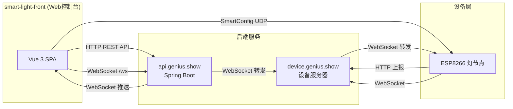
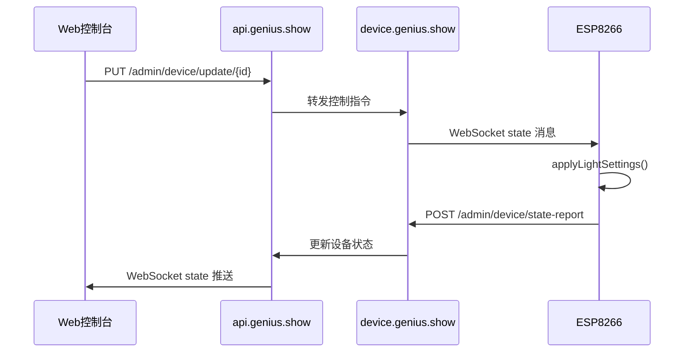
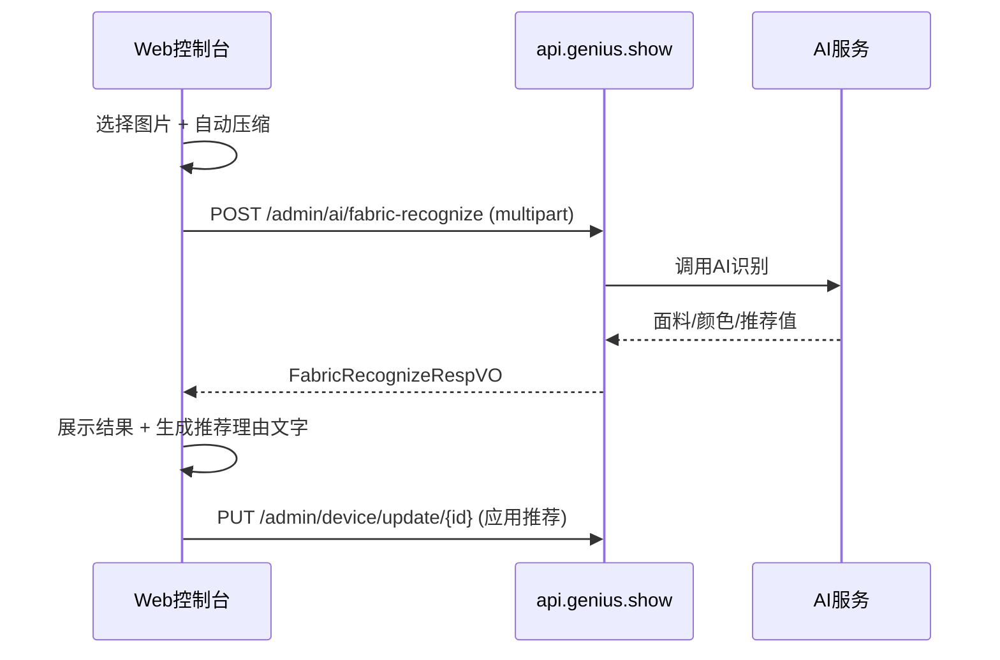
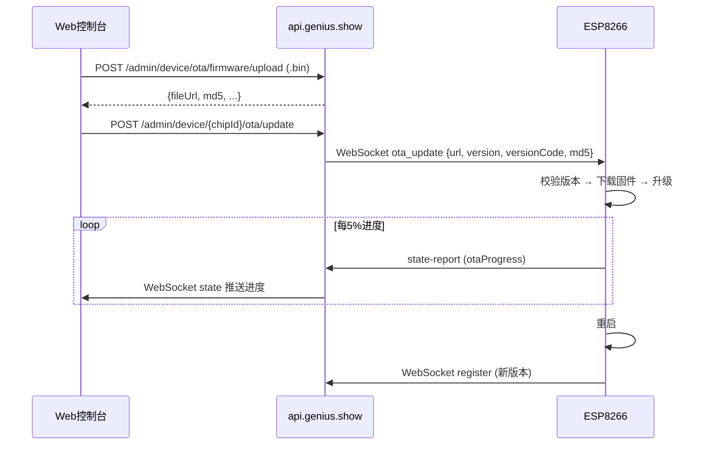

# 项目分析报告 - smart-light-front

## 1. 项目基本信息

| 项目属性 | 内容 |
|----------|------|
| **项目路径** | `E:\smart-light-front` |
| **项目类型** | Vue 3 SPA Web 前端 (Web 控制台) |
| **技术栈** | Vue 3.5 + Vite 8 + TypeScript 6 + Pinia 3 + Vue Router 5 |
| **主要运行环境** | 浏览器 (Web) + Android (Capacitor 混合应用) |
| **主要职责** | Web 控制台：设备管理、灯光控制、AI 上传、灯效控制、OTA 管理、数据看板、店铺设置、SmartConfig 配网 |
| **与其他项目的关系** | 系统的 Web 端管理界面，与 `smart-light-mini` (小程序) 共享后端 API |
| **后端 API 基址** | `https://api.genius.show` |
| **设备服务器** | `device.genius.show:80` |
| **Capacitor AppID** | `com.genius.smartlight` |
| **Git 仓库** | 是，当前分支 `master`，有未跟踪目录 `.claude/` |

## 2. 项目目录结构

| 目录 | 用途 | 类型 |
|------|------|------|
| `src/` | 源代码根目录 | 核心源码 |
| `src/views/` | 5 个页面级组件 (Login, Register, StoreSetup, StoreProfile, SmartLightDashboard) | 核心源码 |
| `src/components/` | 24 个可复用组件 (5 个分类子目录) | 核心源码 |
| `src/components/common/` | 3 个通用组件 (BaseSelect, OdometerRoll, ToastContainer) | 核心源码 |
| `src/components/device/` | 5 个设备组件 (DeviceCard, DeviceGrid, DeviceAddModal, LightEffectMiniPanel, StoreLightLayout) | 核心源码 |
| `src/components/firmware/` | 1 个固件管理组件 (FirmwareManagePanel) | 核心源码 |
| `src/components/flow/` | 8 个数据图表组件 (Chart.js) | 核心源码 |
| `src/components/layout/` | 2 个布局组件 (SidebarNav, TopStatusBar) | 核心源码 |
| `src/components/settings/` | 5 个设置组件 (ArmControlPanel, DurationQueryPanel, FlowMonitorPanel, SmartConfigPanel, StoreSettingsPanel, ProvinceCityPicker) | 核心源码 |
| `src/api/` | 10 个 API 封装模块 | 核心源码 |
| `src/composables/` | 4 个组合式函数 (useClock, useShake, useToast, useWebSocket) | 核心源码 |
| `src/types/` | 6 个 TypeScript 类型定义文件 | 核心源码 |
| `src/constants/` | 2 个常量文件 | 核心源码 |
| `src/utils/` | 4 个工具函数文件 | 核心源码 |
| `src/router/` | 路由配置 (6 条路由 + 守卫) | 核心源码 |
| `android/` | Capacitor Android 原生项目 | 平台代码 |
| `assets/` | 静态资源 | 静态资源 |
| `public/` | 公共资源 | 静态资源 |
| `dist/` | 构建产物 | 构建产物 (排除) |
| `node_modules/` | 依赖包 | 构建产物 (排除) |

## 3. 代码规模统计

| 统计项 | 数值 |
|--------|------|
| Vue 文件数 (.vue) | 31 |
| TypeScript 文件数 (.ts) | 29 |
| CSS 文件数 (.css) | 1 |
| **源码文件总数** | **61** |
| Vue 代码行数 | ~18,286 |
| TypeScript 代码行数 | ~1,746 |
| CSS 代码行数 | ~374 |
| **总源码行数** | **~20,406** |

### 最大源文件 Top 20

| 文件 | 行数 | 说明 |
|------|------|------|
| `src/views/SmartLightDashboard.vue` | ~3,273 | 核心仪表盘 (4 Tab) |
| `src/components/device/DeviceCard.vue` | ~2,214 | 设备卡片+详情+OTA |
| `src/components/device/LightEffectMiniPanel.vue` | ~1,861 | 灯效控制面板 |
| `src/components/device/StoreLightLayout.vue` | ~1,592 | 店铺灯具布局拖拽 |
| `src/components/firmware/FirmwareManagePanel.vue` | ~1,131 | 固件上传/管理 |
| `src/components/settings/SmartConfigPanel.vue` | ~861 | SmartConfig 配网 |
| `src/components/settings/ArmControlPanel.vue` | ~830 | 云台控制面板 |
| `src/views/StoreProfileView.vue` | ~687 | 店铺设置编辑 |
| `src/views/StoreSetup.vue` | ~662 | 店铺初始配置 |
| `src/views/LoginView.vue` | ~519 | 登录页 |
| `src/views/RegisterView.vue` | ~476 | 注册页 |
| `src/components/layout/SidebarNav.vue` | ~475 | 左侧导航栏 |
| `src/components/device/DeviceAddModal.vue` | ~426 | 设备添加弹窗 |
| `src/components/settings/StoreSettingsPanel.vue` | ~381 | 店铺概览面板 |
| `src/components/common/BaseSelect.vue` | ~343 | 通用下拉选择器 |
| `src/constants/china-region.ts` | ~303 | 中国省市数据 |
| `src/components/settings/FlowMonitorPanel.vue` | ~296 | 人流监测面板 |
| `src/components/settings/ProvinceCityPicker.vue` | ~260 | 省市选择器 |
| `src/components/settings/DurationQueryPanel.vue` | ~244 | 热区查询面板 |
| `src/components/common/OdometerRoll.vue` | ~212 | 滚动数字动画 |

## 4. 核心功能清单

### 4.1 页面

| 页面路由 | 组件 | 行数 | 主要功能 |
|----------|------|------|---------|
| `/login` | LoginView.vue | 519 | 用户登录、"记住我"、品牌展示 |
| `/register` | RegisterView.vue | 476 | 用户注册、注册后自动登录 |
| `/store-setup` | StoreSetup.vue | 662 | 店铺初始配置、支持跳过 |
| `/store-profile` | StoreProfileView.vue | 687 | 店铺信息编辑 |
| `/smartlightdashboard` | SmartLightDashboard.vue | 3,273 | **核心仪表盘**：4个Tab |

### 4.2 SmartLightDashboard 四Tab功能

| Tab | Key | 包含组件 | 功能说明 |
|-----|-----|---------|---------|
| **实时灯控** | `main` | DeviceAddModal, DeviceGrid, StoreLightLayout, LightEffectMiniPanel, BaseSelect, OdometerRoll | 时间天气、光照值动画、设备扫描、灯效控制、店铺布局拖拽、设备卡片网格 |
| **数据仪表盘** | `flow` | FlowOverview, HeatmapCard, LuxTrendCard, TempPeopleTrendCard, StrategyCompareCard, DistributionChartCard | Chart.js 图表：热区分布、光照曲线、温度/人流趋势、策略对比、亮度分布 |
| **设置** | `settings` | StoreSettingsPanel, DurationQueryPanel, ArmControlPanel, FlowMonitorPanel, SmartConfigPanel | 店铺概览、日夜模式、热区查询、云台控制、SmartConfig 配网 |
| **固件管理** | `firmware` | FirmwareManagePanel | OTA 固件上传、版本历史管理、URL复制 |

### 4.3 功能详表

| 功能 | 涉及文件 | 关键函数/方法 | 说明 |
|------|---------|--------------|------|
| 用户认证 | LoginView, RegisterView, auth.ts | `loginApi()`, `registerApi()` | JWT 认证，支持记住用户名 |
| 店铺管理 | StoreSetup, StoreProfileView, store.ts | `setupCurrentStoreApi()` | 初始化+编辑店铺信息 |
| 设备管理 | DeviceCard, DeviceAddModal, DeviceGrid, device.ts | `createDevice()`, `updateDevice()`, `deleteDevice()` | 完整 CRUD + 手动/扫描添加 |
| 灯光控制 | DeviceCard, SmartLightDashboard | 亮度/色温滑块 + 自动模式 | 通过 WebSocket + HTTP 双通道控制 |
| 灯效控制 | LightEffectMiniPanel, lightEffect.ts | 5种预设 + 色温循环 (Wave) | 支持设备分组应用 |
| AI 面料识别 | DeviceCard, ai.ts | `fabricRecognize()` | 图片上传、分割展示、推荐理由 |
| 云台控制 | ArmControlPanel, device.ts | `armControl()` | 方向/速度、预设 (aim_person/aim_cloth) |
| 店铺布局 | StoreLightLayout | 拖拽分区和灯具 | Pointer Events，坐标保存到后端 |
| 固件管理 | FirmwareManagePanel, device.ts | `uploadFirmware()`, `getFirmwareHistory()` | 上传 .bin、版本记录、设备 OTA 触发 |
| OTA 升级 | DeviceCard | `checkFirmwareUpdate()`, `startOtaUpdate()` | 检查更新 + 进度条 |
| SmartConfig 配网 | SmartConfigPanel | Capacitor AndroidSmartConfig | ESP8266 一键配网 |
| 数据看板 | FlowOverview + 7 个 ChartCard | Chart.js 渲染 | 热区/光照/温度/人流/策略对比 |
| 人流监测 | FlowMonitorPanel, DurationQueryPanel | `getDurationSummary()` | 热区停留时长统计 |
| 天气显示 | SmartLightDashboard, weather.ts | `getCurrentWeather()` | 实时天气信息 |
| WebSocket | useWebSocket.ts | 自动连接/重连 | 9种消息类型实时推送 |
| Toast 通知 | ToastContainer, useToast.ts | `show(text, type)` | 全局通知，3秒自动消失 |
| 日夜模式 | StoreSettingsPanel | `SMART_LIGHT_NIGHT_MODE` localStorage | 浅色/深色主题切换 |
| 数字滚动动画 | OdometerRoll.vue | SVG/Canvas 滚动数字 | 光照值显示动画 |

## 5. 接口统计与接口清单

### 5.1 接口总览

| 类型 | 数量 | 说明 |
|------|------|------|
| HTTP API 函数 | 32 | 分布在 10 个 API 模块文件中 |
| WebSocket 消息类型 | 9 (接收) | 实时推送 |
| Axios 实例 | 1 | `api/http.ts` 封装 |

### 5.2 HTTP API 详细清单

**鉴权模块 (api/auth.ts)**

| 序号 | 方法 | 路径 | 说明 |
|------|------|------|------|
| 1 | POST | `/api/auth/register` | 用户注册 |
| 2 | POST | `/api/auth/login` | 用户登录 |

**店铺模块 (api/store.ts)**

| 序号 | 方法 | 路径 | 说明 |
|------|------|------|------|
| 3 | GET | `/api/store/current` | 获取当前店铺 |
| 4 | POST | `/api/store/setup` | 设置店铺信息 |

**设备模块 (api/device.ts)**

| 序号 | 方法 | 路径 | 说明 |
|------|------|------|------|
| 5 | GET | `/admin/device/list` | 所有设备列表 |
| 6 | GET | `/admin/device/online-list` | 在线设备列表 |
| 7 | GET | `/admin/device/my-list` | 当前用户设备列表 |
| 8 | POST | `/admin/device/create` | 创建设备 |
| 9 | PUT | `/admin/device/update/{id}` | 更新设备 |
| 10 | DELETE | `/admin/device/delete/{id}` | 删除设备 |
| 11 | POST | `/admin/device/arm/{chipId}` | 云台控制指令 |
| 12 | POST | `/admin/device/flow-upload/{chipId}` | 人流监测开关 |
| 13 | POST | `/admin/device/locate/{chipId}` | 设备定位 (呼吸灯) |
| 14 | POST | `/admin/device/effect/{chipId}` | 灯效指令 |
| 15 | PUT | `/admin/device/{chipId}/firmware-channel` | 更新固件通道 |
| 16 | GET | `/admin/device/{chipId}/ota/check` | 检查 OTA 更新 |
| 17 | POST | `/admin/device/{chipId}/ota/update` | 开始 OTA 升级 |
| 18 | POST | `/admin/device/ota/firmware/upload` | 固件上传 |
| 19 | GET | `/admin/device/ota/firmware/list` | 固件历史列表 |

**AI 模块 (api/ai.ts)**

| 序号 | 方法 | 路径 | 说明 |
|------|------|------|------|
| 20 | POST | `/admin/ai/fabric-recognize` | 服装面料 AI 识别 |

**灯效模块 (api/lightEffect.ts)**

| 序号 | 方法 | 路径 | 说明 |
|------|------|------|------|
| 21 | GET | `/admin/light-effect/state` | 获取灯效状态 |
| 22 | POST | `/admin/light-effect/state` | 保存灯效状态 |
| 23 | POST | `/admin/light-effect/close` | 关闭灯效 |

**光照模块 (api/lux.ts)**

| 序号 | 方法 | 路径 | 说明 |
|------|------|------|------|
| 24 | GET | `/admin/lux/list` | 光照记录列表 |
| 25 | GET | `/admin/lux/get-latest` | 最新光照值 |
| 26 | GET | `/admin/lux/multi-trend` | 多设备光照趋势 |

**停留时长模块 (api/duration.ts)**

| 序号 | 方法 | 路径 | 说明 |
|------|------|------|------|
| 27 | GET | `/admin/duration/summary` | 停留时长摘要 |

**分析模块 (api/analytics.ts)**

| 序号 | 方法 | 路径 | 说明 |
|------|------|------|------|
| 28 | GET | `/admin/analytics/temp-people-trend` | 温度/人流趋势 |
| 29 | GET | `/admin/analytics/strategy-compare` | 亮度策略对比 |

**天气模块 (api/weather.ts)**

| 序号 | 方法 | 路径 | 说明 |
|------|------|------|------|
| 30 | GET | `/admin/weather/current` | 当前天气 |

### 5.3 WebSocket 接口

**连接地址**: `wss://api.genius.show/ws` (子协议: JWT Token)

**文件**: `src/composables/useWebSocket.ts` (161 行)

| 序号 | 消息类型 | 方向 | 处理位置 | 说明 |
|------|---------|------|---------|------|
| 1 | `state` | 后端→前端 | SmartLightDashboard | 设备状态更新 |
| 2 | `lightEffectState` | 后端→前端 | SmartLightDashboard | 灯效状态变更 |
| 3 | `onlineStatus` | 后端→前端 | SmartLightDashboard | 设备上下线 |
| 4 | `fabricRecognize` | 后端→前端 | SmartLightDashboard | AI识别结果推送 |
| 5 | `deviceDeleted` | 后端→前端 | SmartLightDashboard | 设备被删除 |
| 6 | `personDetection` | 后端→前端 | SmartLightDashboard | 人形检测 |
| 7 | `durationUpdate` | 后端→前端 | SmartLightDashboard | 停留时长更新 |
| 8 | `lux` | 后端→前端 | SmartLightDashboard | 光照数据推送 |
| 9 | `announce` | 后端→前端 | SmartLightDashboard | 新设备广播发现 |

### 5.4 WebSocket 连接管理

| 特性 | 实现 |
|------|------|
| 自动连接 | onMounted 时自动建立连接 |
| 断线重连 | 3秒后自动重连 (手动关闭不重连) |
| 鉴权 | 子协议使用 JWT Token |
| URL/Token 变更 | 自动重连 |
| 暴露方法 | `connect`, `reconnect`, `close`, `send` |

## 6. 页面、组件、模块统计

### 6.1 统计总览

| 统计项 | 数值 |
|--------|------|
| 页面/视图数 | 5 |
| 组件总数 | 24 |
| 通用组件 | 3 (BaseSelect, OdometerRoll, ToastContainer) |
| 设备组件 | 5 |
| 布局组件 | 2 (SidebarNav, TopStatusBar) |
| 设置组件 | 6 |
| 仪表盘图表组件 | 8 |
| API 模块数 | 10 |
| Composables 数 | 4 |
| 类型定义文件数 | 6 |
| 工具函数文件数 | 4 |
| 常量文件数 | 2 |
| 路由定义数 | 7 (含 1 重定向) |

### 6.2 类型定义清单

| 文件 | 行数 | 主要内容 |
|------|------|---------|
| `src/types/device.ts` | 112 | `DeviceItem` (44字段), `DeviceOnlineItem`, `DeviceCreatePayload`, `FirmwareItem`, `OtaCheckResult` 等 |
| `src/types/auth.ts` | 27 | `LoginReq`, `RegisterReq`, `LoginResp` |
| `src/types/analytics.ts` | 16 | `TrendPoint`, `TempPeopleTrendData`, `StrategyCompareData` |
| `src/types/store.ts` | 10 | `StoreInfo` |
| `src/types/duration.ts` | 4 | `DurationSummaryItem` |
| `src/types/lux.ts` | 7 | `LuxRecord` |

### 6.3 常用本地存储 Key

| Key | 存储方式 | 内容 |
|-----|---------|------|
| `TOKEN` | localStorage / sessionStorage | JWT 令牌 |
| `USER_INFO` | localStorage / sessionStorage | 用户信息 JSON |
| `storeSetup` | localStorage / sessionStorage | `{configured, skipped}` |
| `REMEMBER_USERNAME` | localStorage | 记住的用户名 |
| `SMART_LIGHT_NIGHT_MODE` | localStorage | `'1'` / `'0'` |
| `SMART_LIGHT_LAYOUT_POSITIONS` | localStorage | 灯具布局坐标 JSON |
| `SMART_LIGHT_LAYOUT_ZONES` | localStorage | 分区布局 JSON |
| `smartlight_effect_brightness_preset` | localStorage | 灯效亮度预设 |

## 7. 数据模型与配置

### 7.1 核心数据模型

**DeviceItem** (src/types/device.ts):
id, chipId, deviceCode, deviceName, deviceType, ip, online, lastSeen, brightness, temp, autoMode, recommendedBrightness, recommendedTemp, fabric, fabricConfidence, fabricRecognizeTime, mainColorR, mainColorG, mainColorB, annotatedImageUrl, originalImageUrl, firmwareVersion, firmwareVersionCode, firmwareChannel, otaStatus, otaProgress, flowUploadEnabled, personCount, lastPersonDetectedTime, luxValue, luxCollectTime, zone, armStatus, storeId, userId...

### 7.2 配置项

| 配置 | 位置 | 默认值 | 说明 |
|------|------|--------|------|
| API 基址 | `.env` | `https://api.genius.show` | VITE_API_BASE |
| 设备服务器 | `.env` | `device.genius.show:80` | VITE_DEVICE_SERVER_HOST/PORT |
| Axios 超时 | `api/http.ts` | 10000ms | 请求超时 |
| WS 重连间隔 | `useWebSocket.ts` | 3000ms | 断线重连等待 |

## 8. 运行与构建方式

### 8.1 构建命令

| 命令 | 说明 |
|------|------|
| `npm install` / `pnpm install` | 安装依赖 |
| `npm run dev` / `pnpm dev` | 开发服务器 (Vite) |
| `npm run build` / `pnpm build` | 生产构建 (`vue-tsc -b && vite build`) |
| `npm run preview` / `pnpm preview` | 预览生产构建 |
| `npx cap sync` | 同步 Capacitor 平台代码 |
| `npx cap open android` | 在 Android Studio 中打开 |

### 8.2 Capacitor (Android 混合应用)

- **AppID**: `com.genius.smartlight`
- **webDir**: `dist`
- **特殊配置**: `allowMixedContent: true` (允许 HTTP), `android:usesCleartextTraffic: true`
- **原生插件**: `AndroidSmartConfig` (ESP8266 SmartConfig 配网)

### 8.3 依赖

| 核心依赖 | 版本 | 用途 |
|----------|------|------|
| vue | ^3.5.32 | 前端框架 |
| vue-router | ^5.0.4 | 路由 |
| pinia | ^3.0.4 | 状态管理 (已安装，未实际使用) |
| axios | ^1.15.0 | HTTP 客户端 |
| chart.js | ^4.5.1 | 数据图表 |
| @capacitor/core | ^8.3.1 | 跨平台原生桥接 |

## 9. 项目之间的调用关系

### 9.1 与后端通信架构

### 9.2 设备控制完整流程

### 9.3 AI 识别流程

### 9.4 OTA 升级流程

## 10. 风险点与维护建议

| 风险类型 | 具体位置 | 风险描述 | 维护建议 |
|----------|---------|---------|---------|
| **超大型组件** | `SmartLightDashboard.vue` (3,273行) | 单体组件包含 4 个 Tab 的全部逻辑和 UI | 拆分为独立 Tab 组件，Dashboard 只做路由容器 |
| **超大型组件** | `DeviceCard.vue` (2,214行) | 一个组件承载设备卡片+详情弹窗+OTA+面料等多重职责 | 拆分为 DeviceCard + DeviceDetailModal + OtaPanel 三个组件 |
| **超大型组件** | `LightEffectMiniPanel.vue` (1,861行) | 灯效面板过于庞大 | 提取滑块组件、预设选择器、循环参数配置为独立组件 |
| **超大型组件** | `StoreLightLayout.vue` (1,592行) | 拖拽布局逻辑与渲染耦合 | 提取拖拽逻辑为 composable |
| **Pinia 未使用** | 全局 | package.json 安装但未创建 store 文件 | 用 Pinia 管理设备列表、在线状态等全局共享状态 |
| **重复图表组件** | `flow/` 目录 | `TempPeopleTrendCard` 和 `TempFlowChartCard` 疑似重复 | 确认并合并 |
| **localStorage 碎片化** | 8 个不同 Key | 状态分散在 localStorage 各处 | 统一使用 Pinia store + 插件持久化 |
| **无单元测试** | 全局 | 无任何测试文件 (.spec.ts / .test.ts) | 至少对 critical API 调用和工具函数添加测试 |
| **硬编码字符串** | SmartLightDashboard | WebSocket 消息 type 字符串散布 | 抽取为 enum 或常量 |
| **CSS 内联样式** | 多个组件 | 大量内联 style 绑定 | 迁移到 scoped CSS 或 CSS 变量 |
| **Capacitor 依赖** | SmartConfigPanel | SmartConfig 依赖原生插件 | 在非 Android 环境需优雅降级 |

## 11. 重要文件索引

| 文件路径 | 行数 | 作用 | 为什么重要 |
|----------|------|------|-----------|
| `src/views/SmartLightDashboard.vue` | 3,273 | 核心仪表盘 | 最大的组件，集成所有主要功能 |
| `src/components/device/DeviceCard.vue` | 2,214 | 设备卡片+详情+OTA | 设备交互核心入口 |
| `src/components/device/LightEffectMiniPanel.vue` | 1,861 | 灯效控制 | Wave 循环灯效的完整实现 |
| `src/components/device/StoreLightLayout.vue` | 1,592 | 店铺布局拖拽 | 可视化灯具位置管理 |
| `src/components/firmware/FirmwareManagePanel.vue` | 1,131 | 固件管理 | OTA 版本管理核心 |
| `src/api/device.ts` | ~130 | 设备 API | 最多的 API 接口定义 (19个) |
| `src/api/http.ts` | 90 | HTTP 客户端 | JWT 注入、错误拦截 |
| `src/composables/useWebSocket.ts` | 161 | WebSocket 连接管理 | 实时数据推送核心 |
| `src/router/index.ts` | 121 | 路由配置 | 6条路由 + 完整导航守卫 |
| `src/types/device.ts` | 112 | 设备类型定义 | 44 字段的 DeviceItem 核心模型 |
| `src/components/common/BaseSelect.vue` | 343 | 通用下拉选择器 | 唯一通用表单组件，Teleport 实现 |
| `src/components/settings/SmartConfigPanel.vue` | 861 | SmartConfig 配网 | Capacitor 原生能力调用 |
| `src/components/settings/ArmControlPanel.vue` | 830 | 云台控制 | 云台+滑轨+预设控制 |
| `src/utils/lightRecommendationReason.ts` | 159 | AI推荐理由生成 | 照明建议文字生成引擎 |
| `src/constants/china-region.ts` | 303 | 省市数据 | 含城市经纬度的完整地域数据 |
| `src/views/LoginView.vue` | 519 | 登录页 | 认证入口 |
| `src/composables/useToast.ts` | 22 | Toast 通知 | 全局通知系统 |
| `src/composables/useClock.ts` | 38 | 时钟 | 仪表盘时间显示 |
| `src/components/layout/SidebarNav.vue` | 475 | 导航栏 | 响应式侧边栏/底部导航 |
| `src/components/common/OdometerRoll.vue` | 212 | 滚动数字 | 光照值动画组件 |

## 12. 统计摘要

| 统计项 | 数值 |
|--------|------|
| 总源码文件数 | 61 |
| 总代码行数 | ~20,406 |
| 页面/视图数 | 5 |
| 组件数 | 24 |
| HTTP API 函数数 | 32 |
| WebSocket 消息类型 | 9 |
| 类型定义文件 | 6 |
| Composables 数 | 4 |
| Chart.js 图表组件 | 8 |
| 构建命令 | `pnpm dev` / `pnpm build` |
| 移动端平台 | Android (Capacitor) |
| 主要风险 | 4个超大组件 (>1500行)、Pinia未使用、无测试代码 |
